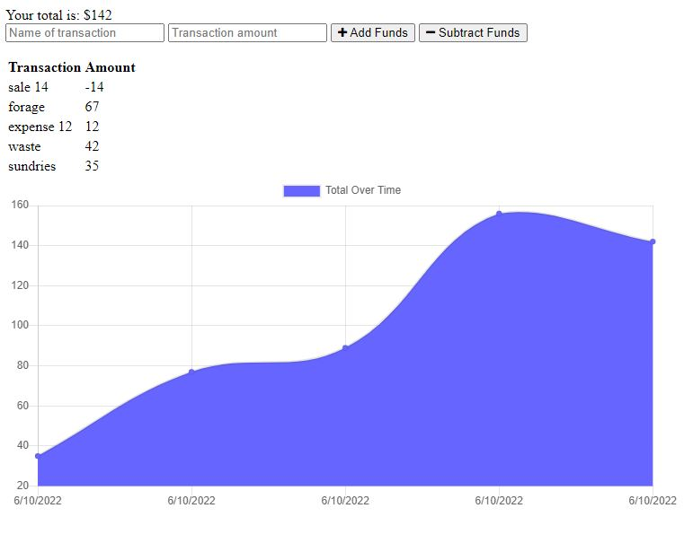

# Budget Tracker PWA

A progressive web application that can be used either on or offline for tracking budget and expenses 
## Getting Started

Just go ahead and start entering transaction in the app. Make sure to connect to the website at least once before going in offline mode.

## Deployed Link

* [see live site](https://cryptic-journey-24159.herokuapp.com/)

## Screen shot

## Built With

* [Javascript](https://developer.mozilla.org/en-US/docs/Web/JavaScript)
* [Node.js](https://nodejs.org/)
* [MongoDB](https://www.mongodb.com/)
* [Mongoose](https://mongoosejs.com/)

## License

This project is licensed under the [MIT License](https://opensource.org/licenses/MIT)